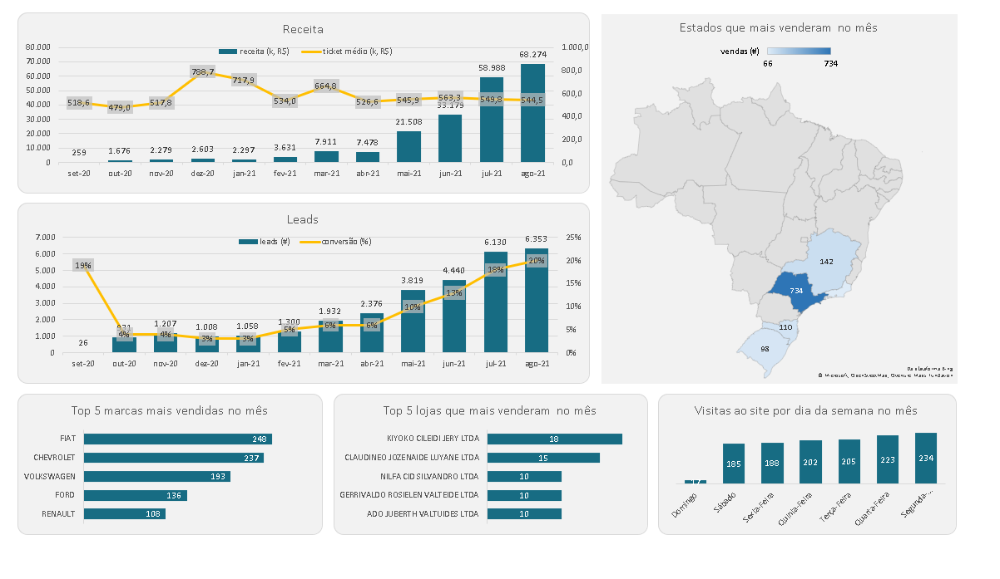
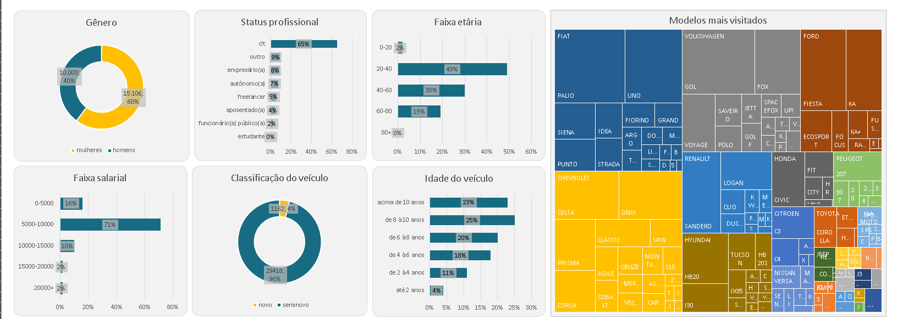

---

# Projetos de Análise de Dados com SQL (Curso Midori - Udemy)

Este repositório contém as análises e consultas SQL desenvolvidas durante o curso da Midori na Udemy. Os projetos simulam cenários reais de Business Intelligence e análise de CRM, focando na transformação de dados brutos em indicadores estratégicos.

## 📋 Visão Geral dos Projetos

Os projetos foram estruturados em duas grandes frentes de análise utilizando bancos de dados relacionais:

### 1. Dashboard de Performance de Vendas

O objetivo foi extrair métricas de desempenho para suporte à tomada de decisão gerencial.

* **KPIs Analisados:** Receita total, volume de leads, taxa de conversão e ticket médio.
* **Segmentações:** Análise temporal (mês a mês), geográfica (estados) e por marca/loja.
* **Principais Insights:** Identificação de picos de faturamento (ex: R$ 7,9M em Março/21) e comportamento de tráfego (maior volume de visitas às segundas-feiras).

### 2. Análise de Perfil de Leads (CRM)

Focado na compreensão da base de clientes para otimização de campanhas de marketing e vendas.

* **Perfil Demográfico:** Classificação por gênero, faixa etária e status profissional.
* **Perfil Econômico:** Análise de faixa salarial cruzada com o interesse por categorias de produtos.
* **Comportamento de Consumo:** Mapeamento de interesse por marca de veículo e idade da frota (seminovos vs. novos).
* **Principais Insights:** Constatação de que 65% da base é composta por profissionais CLT e que a maior concentração de leads está na faixa de 20 a 40 anos.

## 🛠️ Tecnologias e Conceitos Aplicados

* **Linguagem:** SQL
* **Comandos Utilizados:** * `SELECT`, `FROM`, `WHERE` (Filtros avançados)
* `GROUP BY` e `ORDER BY` (Agregações e ordenação)
* `JOINs` (Relacionamento entre múltiplas tabelas)
* `CTEs` e `Subqueries` (Consultas complexas)
* Funções de Agregação (`SUM`, `COUNT`, `AVG`) e tratamento de dados.

## 📈 Resultados Alcançados

A execução destes projetos permitiu consolidar a habilidade de:

1. Estruturar queries eficientes para grandes volumes de dados.
2. Gerar relatórios de BI que identificam gargalos operacionais.
3. Fornecer dados precisos para a segmentação de clientes e estratégias de vendas.

---

**Nota:** Projeto desenvolvido como parte do programa de formação em SQL da professora Midori (Udemy).

## 📊 Visualização dos Projetos

### Dashboard de Vendas

### Perfil dos Leads
